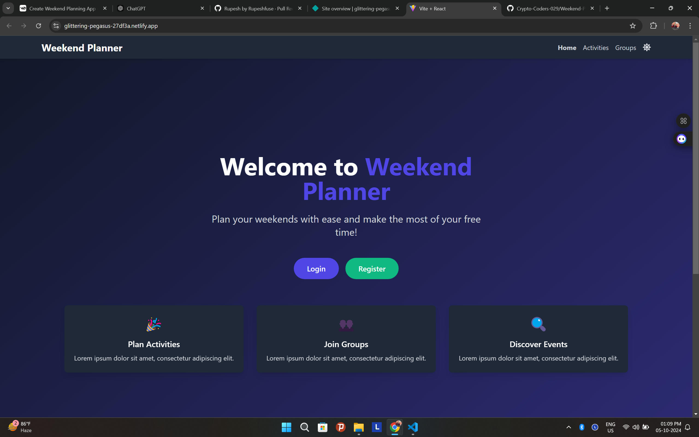

Weekend Planner:

Introduction
Weekend Planner is an innovative application designed to simplify and enhance the process of planning weekends with friends. It addresses the common challenges of coordinating schedules, deciding on activities, and managing group logistics. Our platform aims to streamline the planning process, making it easier for friends to spend quality time together without the usual hassles of organization.

Project Type
Frontend

Deployed App
Netlify : https://our-weekend-planner.netlify.app/
Github : https://github.com/Iftekhar1405/Crypto-Coders-029/tree/main

Project Screenshot :

Directory Structure
weekend-planner/
├── .env
├── .gitignore
├── index.html
├── package.json
├── postcss.config.js
├── README.md
├── tailwind.config.js
├── vite.config.js
├── db.json
├── public/
│ └── assets/
│ ├── logo.svg
│ └── background.jpg
└── src/
├── components/
│ ├── AdminDashboard.jsx
│ ├── DarkModeToggle.jsx  
│ ├── SampleNotifications.jsx
│ ├── Header.jsx
│ ├── Footer.jsx
│ ├── AuthForm.jsx
│ ├── GroupScheduler.jsx
│ ├── ActivitySuggestions.jsx
│ ├── PollsAndVoting.jsx
│ ├── NotificationManager.jsx
│ ├── UserManagement.jsx
│ ├── EventAnalytics.jsx
│ └── SupportFeedback.jsx
├── hooks/
│ ├── useAuth.js
│ ├── usefirebase.js
│ └── useScheduler.js
├── pages/
│ ├── Home.jsx
│ ├── Dashboard.jsx
│ ├── Profile.jsx
│ ├── Activities.jsx
│ ├── Groups.jsx
│ ├── Admin.jsx
│ ├── PrivacyPolicy.jsx
│ ├── ContactUs.jsx
│ └── Registration.jsx
│ └── TermsOfService.jsx
│ └── CookiePolicy.jsx
├── services/
│ ├── NotificationService.jsx
├── utils/
│ ├── firebase.js
│ └── graphDataStructure.js
│ └── initializeLocationGraph.js
│ └── notifications.js
├── App.css
├── index.css
├── App.jsx
└── main.jsx

Video Walkthrough of the project
Youtube Link : https://youtu.be/J7gMVDaV0Ik

Video Walkthrough of the codebase
Youtube Link : https://youtu.be/OPquyH5CiME

Features

- User Authentication: Multiple login options including email/password, Google, and Facebook
- Group Scheduling: Shared availability and common free time finder
- Activity Suggestions: Curated list of events and venues based on user preferences
- Polls and Voting: Create and participate in polls for group decision making
- Notification Management: Reminders and updates to keep everyone informed
- Admin Dashboard: User management, event analytics, and support/feedback management
- Social Component: Connect with users planning similar activities

Design Decisions & Assumptions

- Used React for the frontend to leverage its component-based architecture and efficient rendering
- Implemented Firebase for authentication and real-time database to handle user data and real-time updates
- Utilized Tailwind CSS for rapid UI development and consistent styling
- Assumed users have access to modern web browsers with JavaScript enabled
- Designed with mobile-first approach for responsive layout across devices

Installation & Getting started
To get the Weekend Planner up and running on your local machine, follow these steps:

1. Clone the repository
   git clone "[Repository Link](https://github.com/Iftekhar1405/Crypto-Coders-029.git)"

2. Navigate to the project directory
   cd weekend-planner

3. Install dependencies
   npm install

4. Set up environment variables
   Create a .env file in the root directory and add your Firebase configuration:
   VITE_FIREBASE_API_KEY=your_api_key
   VITE_FIREBASE_AUTH_DOMAIN=your_auth_domain
   VITE_FIREBASE_DATABASE_URL=your_database_url
   VITE_FIREBASE_PROJECT_ID=your_project_id
   VITE_FIREBASE_STORAGE_BUCKET=your_storage_bucket
   VITE_FIREBASE_MESSAGING_SENDER_ID=your_messaging_sender_id
   VITE_FIREBASE_APP_ID=your_app_id
   VITE_FIREBASE_MEASUREMENT_ID=your_measurement_id

5. Start the development server
   npm run dev

Usage
After starting the development server, open your web browser and navigate to http://localhost:3000. You can register a new account or log in with the provided credentials.

Example of creating a new group and scheduling an event:

1. Log in to your account
2. Navigate to the Dashboard
3. Click on "Create New Group"
4. Add members to your group
5. Go to the Group Scheduler
6. Select available times
7. View common free times for the group
8. Create a new event based on the common free time

Credentials
For testing purposes, you can use the following credentials:

- Regular User:
  - Email: user@example.com
  - Password: password123
- Admin User:
  - Email: admin@example.com
  - Password: admin123

APIs Used

- Google Calendar API: For syncing and managing schedules
- Google Places API: For activity and venue suggestions

API Endpoints

- GET /api/groups - Retrieve all groups for the authenticated user
- POST /api/groups - Create a new group
- GET /api/events - Retrieve all events for the authenticated user
- POST /api/events - Create a new event
- GET /api/suggestions - Get activity suggestions based on user preferences
- POST /api/polls - Create a new poll
- GET /api/polls/:groupId - Get all polls for a specific group

Technology Stack

- Frontend: React, Vite, Tailwind CSS
- Database: Firebase Realtime Database
- Authentication: Firebase Authentication
- State Management: React Hooks
- Routing: React Router
- API Requests: Axios
- Date/Time Manipulation: date-fns
- Notifications: react-toastify

Team Members

- Team Lead: Iftekhar Ahmed
- Team Members:
  - Rupesh Fuse
  - Rohit Priyadarshy
  - Praveen Kumar Singh
  - Sumit Gautam
